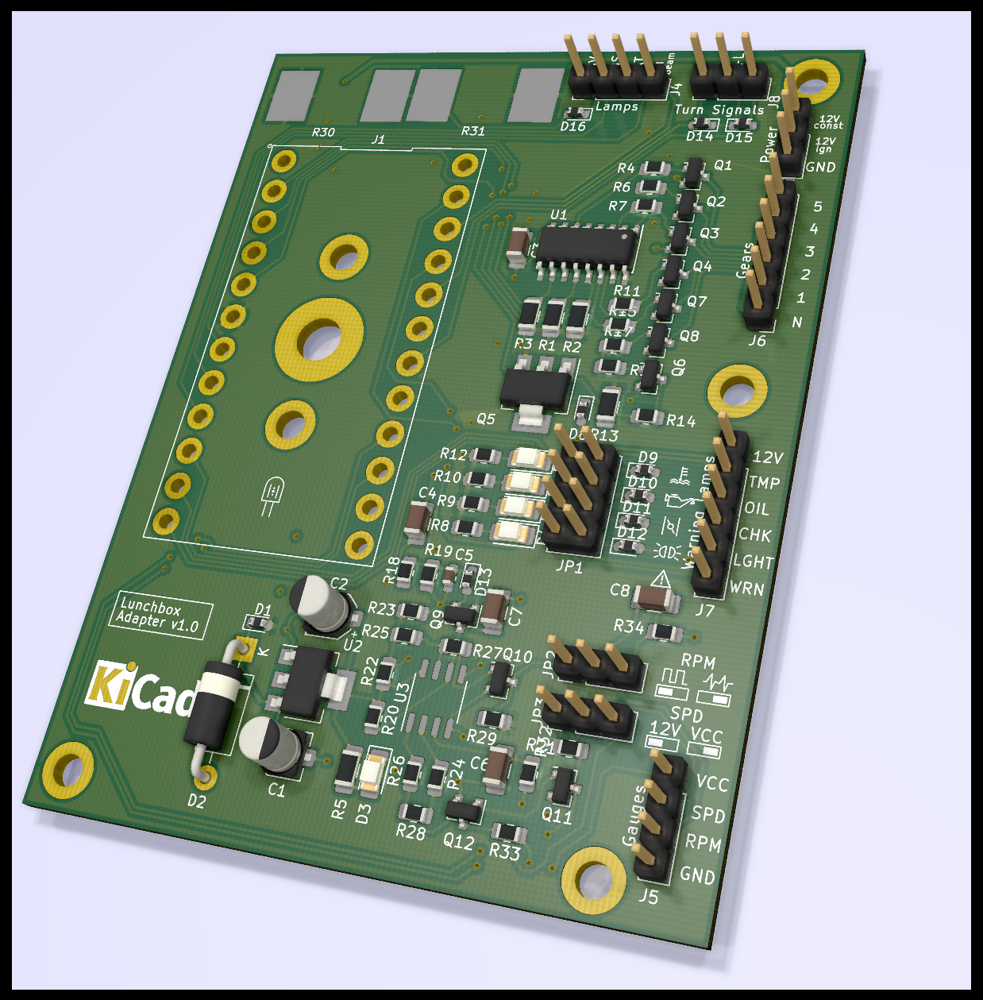

# Introduction

This is my interpretation of the *BrotboxErsatzPlatine* instrument adapter for the BMW K100. It is based on the circuit originally created by Maru (maru-labs.com).
It purpose is to replace the original instrument unit of the BMW K100 (affectionately called *lunchbox* because of its distinctive shape) with 3rd party speedometer units. For more information have a look at maru-labs.com.

This project consists of the KiCAD design files for the schematic and PCB

# Features

* Plugs into the stock connector for the K100 instrument unit
* Convert signal of the original speed sensors to a square wave signal understood by most 3rd party speedos
* Conditioning of primary ignition coil RPM signal and conversion to square wave signal understood by most 3rd party speedos
* Provide excitation current for alternator
* Combine several of the information/warning lights to a common warning light output

## Speed signal voltage

The output voltage of the speed signal can be selected between 12V and a custom supply voltage at PIN1 (VCC) on the Gauges Connector (J5) by setting the jumper JP3 to the appropriate position

## RPM signal waveform

Depending on the type of tacho unit, the output waveform of the RPM signal can be selected between 12V Square wave (pulses to ground) and a sort of cleaned up raw ignition signal by setting jumper JP2 to the appropriate position. The square wave signal should be standard, the latter option is just there as an experiment.

## Warning lights

The warning lights for temperature (TMP), oil pressure (OIL), choke (CHK) and Light-test (LGHT) are displayed by individual LEDs on the board. Additionally, any number of them can be grouped together to a general warning lamp (WRN) if your dashboard has no space for this many lamps. Each of the 4 rows of Jumper JP1 can be bridged to select this warning signal to the general warning lamp. Please be aware that if only the general warning lamp is used you have no information on the source of the warning other than looking at the smd LEDs on the board.

# No warranty

I created this as a hobby project as an experiment / exercise. I will not be responsible for any damage caused to your bike by using all of or parts of this circuit. Use at your own risk.

